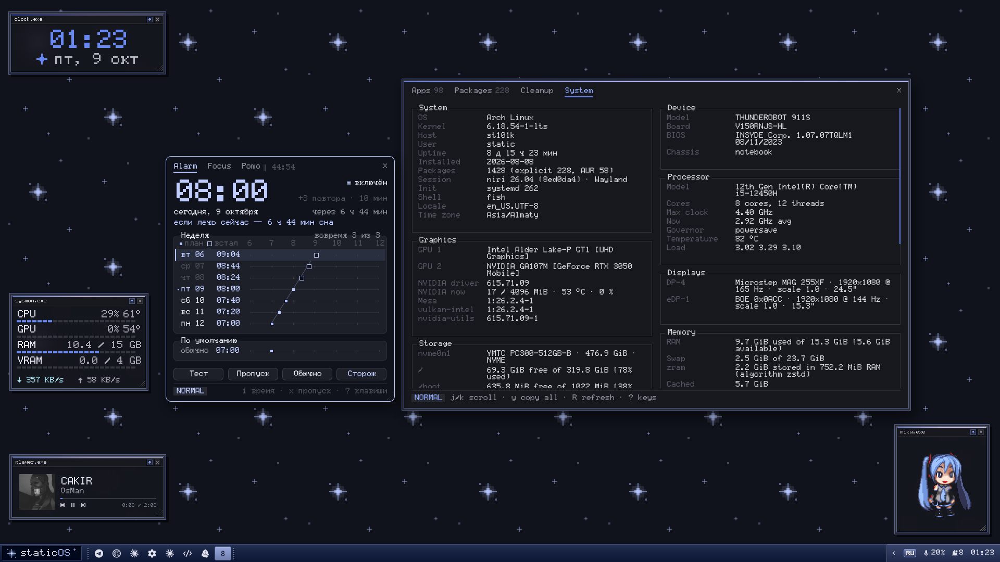
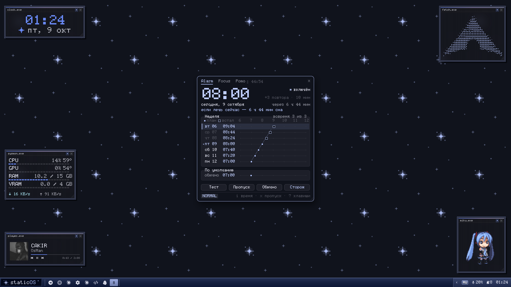
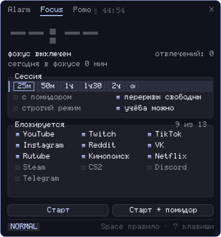
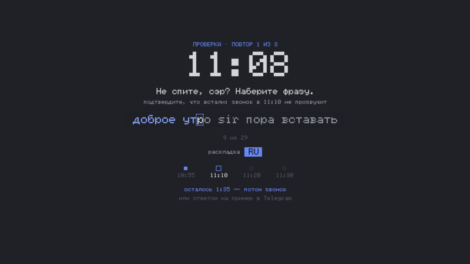
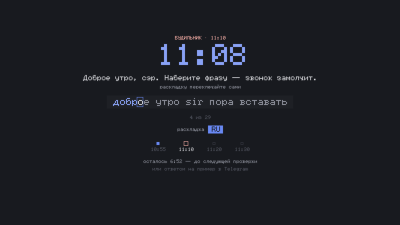
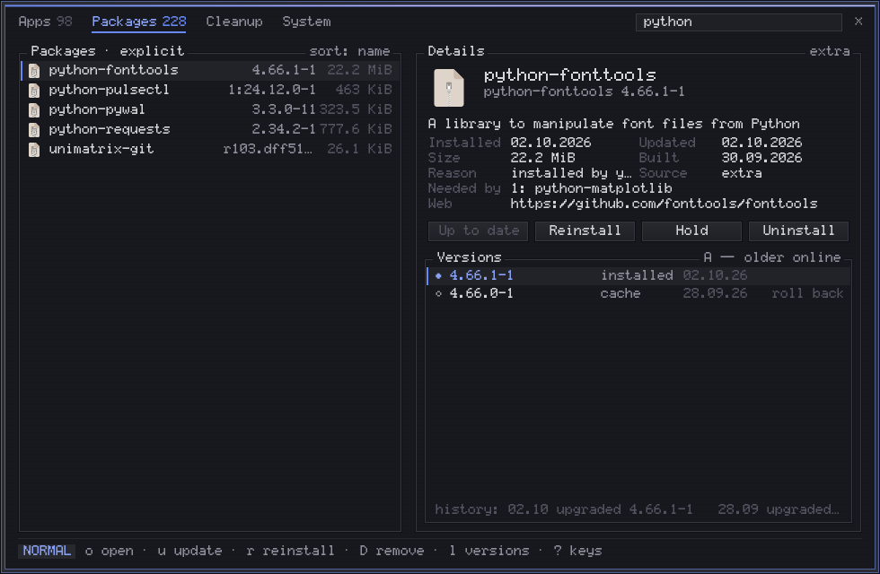
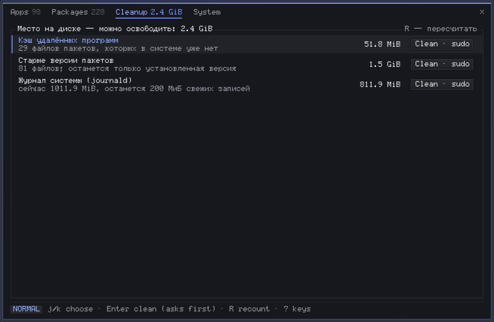
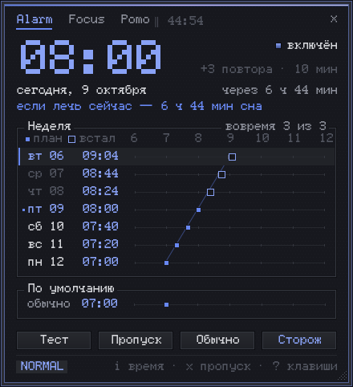
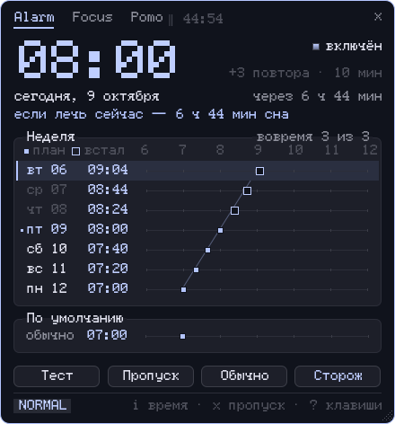

<div align="center">

# staticOS

A pixel-styled [niri](https://github.com/YaLTeR/niri) desktop for Arch Linux.<br>
Every color comes from your wallpaper.




[Install](docs/install.md) · [User guide](docs/guide.md) · [Alarm](docs/alarm.md)

**English** · [Русский](README.ru.md)

</div>

> [!NOTE]
> Screenshots show demo data: a made-up alarm plan and no chats or notifications of anyone's.
> The windows are drawn by the same scripts that run on the desktop.

## Highlights

- **One palette everywhere.** Change the wallpaper and the bar, terminal, notifications,
  GTK/Qt apps, cursor, icons and even the keyboard backlight follow it.
- **Settings in one window** — `Super+/`. Bars, panels, fonts, lock screen, shaders, widgets,
  sounds: no config files to edit. Three looks: Default, Skeet, Beta.
- **An alarm you cannot sleep through.** It stops only when you type a phrase, checks on you
  again later, and a daytime Watchman keeps you from dozing off. [How it works →](docs/alarm.md)
- **Focus and pomodoro.** Block distracting sites and apps for a session, with a pomodoro on top.
- **App list** — `Super+Alt+T`. Programs and packages with versions, one-key rollback to an
  older version, hold, cleanup of package caches and logs, and a full system summary.
- **Desktop widgets and an XP-style taskbar.** Clocks, player, weather, system monitor and more
  as little `.exe` windows; an optional bottom panel with a Start button.
- **Screenshots, OCR and recording.** Annotate, pin a screenshot on top, copy text off the screen,
  record GIFs, videos and Telegram stickers.
- **Own clipboard, Alt+Tab, lock screen and screensaver**, all keyboard-driven with vim keys.

## Screenshots



<p align="center"><i>The other layout: desktop widgets and an XP-style taskbar with a Start button instead of the top bar.</i></p>

| | |
|:-:|:-:|
|  |  |
| Alarm plan for the week | Focus session |
|  |  |
| Morning check | The ring stops when you type the phrase |
|  |  |
| Packages with roll back | Cleanup |

<details>
<summary>Three looks: Default, Skeet, Beta</summary>

| Default | Skeet | Beta |
|:-:|:-:|:-:|
|  |  |  |

</details>

## Install

```sh
git clone https://github.com/staticxyz/staticos.git ~/staticos
cd ~/staticos && ./install.sh
```

Log out, choose **niri** on the login screen, log in. Your own files are backed up first.
`staticos-doctor` checks that nothing is missing.
Other distributions, options and removal: [docs/install.md](docs/install.md).

## First keys

| Keys | |
|---|---|
| `Super+/` | Settings |
| `Super+Shift+/` | All shortcuts |
| `Super+Space` | Launch an app |
| `Super+Return` | Terminal |
| `Super+W` | Wallpaper (recolors everything) |
| `Super+Alt+F` | Alarm, focus, pomodoro |
| `Super+Alt+T` | App list |
| `Super+Alt+V` | Clipboard |
| `Super+C` | Calculator and translator |
| `Super+Print` / `Shift+Print` | Annotated screenshot / copy text from screen |
| `Super+O` / `Alt+F4` | Lock / power menu |

Everything else is in the **[user guide](docs/guide.md)**.

## Notes

- The interface is in Russian; the docs are in English (the alarm guide also [in Russian](docs/ru/alarm.md)).
- No keys, tokens, passwords, browser profiles or personal state are in the repository.
- Scripts live in `~/.config/hypr/scripts` — the setup started on Hyprland and moved to niri.
- Windows XP sounds are not included. Put your own `.wav` files into
  `~/.config/hypr/sounds/xp/`; the retro set is generated during install.
- `fan`, `power`, `kbd_colors.py` and the Razer scripts target one specific laptop and keyboard.
  Elsewhere they do nothing.

## License

[MIT](LICENSE) © 2026 staticxyz. Bundled fonts keep their own licenses —
see [FONTS-LICENSE.md](.local/share/fonts/FONTS-LICENSE.md).
