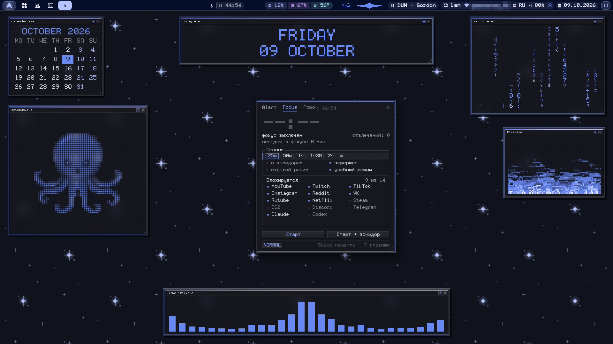
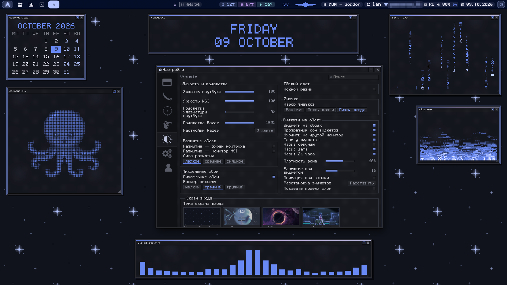

<div align="center">

# staticOS

Пиксельный рабочий стол на [niri](https://github.com/YaLTeR/niri) для Arch Linux.<br>
Все цвета берутся из обоев.


[Установка](docs/install.md) · [Руководство](docs/guide.md) · [Будильник](docs/ru/alarm.md) · [Hub](docs/ru/hub.md) · [Все клавиши](docs/ru/keybindings.md)

[English](README.md) · **Русский**

</div>

> [!NOTE]
> На снимках демо-данные: выдуманный план будильника, ничьих чатов и уведомлений.
> Окна отрисованы теми же скриптами, что работают на рабочем столе.

## Главное

- **Одна палитра на всё.** Смените обои — за ними перекрасятся панель, терминал, уведомления,
  программы GTK/Qt, курсор, значки и даже подсветка клавиатуры.
- **Настройки в одном окне** — `Super+/`. Панели, шрифты, экран блокировки, шейдеры, виджеты,
  звуки — без правки конфигов. Три вида: Default, Skeet, Beta.
- **Будильник, который не проспишь.** Замолкает, только когда наберёшь фразу, потом ещё
  проверяет, а дневной Сторож не даёт задремать. [Как это работает →](docs/ru/alarm.md)
- **Фокус и помидор.** На время сессии блокирует отвлекающие сайты и программы.
- **App list** — `Super+Alt+T`. Программы и пакеты с версиями, откат на старую версию одной
  клавишей, заморозка, чистка кэша пакетов и журналов, сводка о системе.
- **Виджеты на обоях и панель в духе XP.** Часы, плеер, погода, нагрузка и другое — маленькими
  окнами `.exe`; нижняя панель с кнопкой «Пуск» по желанию.
- **Снимки, текст с экрана и запись.** Пометки на снимке, снимок поверх окон, распознавание
  текста, запись GIF, видео и стикеров Telegram.
- **Свои буфер обмена, Alt+Tab, экран блокировки и заставка** — всё с клавиатуры, клавиши vim.
- **Hub** — напоминания, списки, таймеры и словарь с повторением без единого ИИ, своя база
  SQLite, окно в стиле Discipline (`Super+M`) и бот в Telegram на случай, если вас нет за
  компьютером. [Как это работает →](docs/ru/hub.md)

## Снимки



<p align="center"><i>С верхним баром и Focus: блокировка сайтов и программ на время сессии.</i></p>



<p align="center"><i>Настройки: панели, шрифты, виджеты, экран блокировки и прочее в одном окне.</i></p>

| | |
|:-:|:-:|
|  |  |
| План подъёмов на неделю | Сессия фокуса |
|  |  |
| Утренняя проверка | Звонок молчит, только когда набрана фраза |
|  |  |
| Пакеты с откатом версии | Чистка |

<details>
<summary>Три вида: Default, Skeet, Beta</summary>

| Default | Skeet | Beta |
|:-:|:-:|:-:|
|  |  |  |

</details>

## Установка

```sh
git clone https://github.com/staticxyz/staticos.git ~/staticos
cd ~/staticos && ./install.sh
```

Выйдите из системы, выберите **niri** на экране входа и войдите. Ваши файлы сперва
сохраняются в резервную копию. `staticos-doctor` проверит, всего ли хватает.
Другие дистрибутивы, параметры и удаление — в [docs/install.md](docs/install.md).

## Первые клавиши

| Клавиши | |
|---|---|
| `Super+/` | Настройки |
| `Super+Shift+/` | Все сочетания |
| `Super+Space` | Запуск программ |
| `Super+Return` | Терминал |
| `Super+W` | Обои (перекрашивают всё) |
| `Super+Alt+F` | Будильник, фокус, помидор |
| `Super+Alt+T` | App list |
| `Super+Alt+V` | Буфер обмена |
| `Super+C` | Калькулятор и переводчик |
| `Super+Print` / `Shift+Print` | Снимок с пометками / текст с экрана |
| `Super+O` / `Alt+F4` | Блокировка / меню питания |

Остальное — в **[руководстве](docs/guide.md)** (на английском).

## Заметки

- Интерфейс на русском.
- В репозитории нет ключей, токенов, паролей, профилей браузера и личного состояния.
- Скрипты живут в `~/.config/hypr/scripts`: система начиналась на Hyprland и переехала на niri.
- Звуков Windows XP в комплекте нет. Положите свои `.wav` в `~/.config/hypr/sounds/xp/`;
  ретро-набор создаётся при установке.
- `fan`, `power`, `kbd_colors.py` и скрипты Razer написаны под конкретный ноутбук и клавиатуру.
  На другом железе они ничего не делают.

## Лицензия

[MIT](LICENSE) © 2026 staticxyz. У шрифтов в комплекте свои лицензии —
см. [FONTS-LICENSE.md](.local/share/fonts/FONTS-LICENSE.md).
